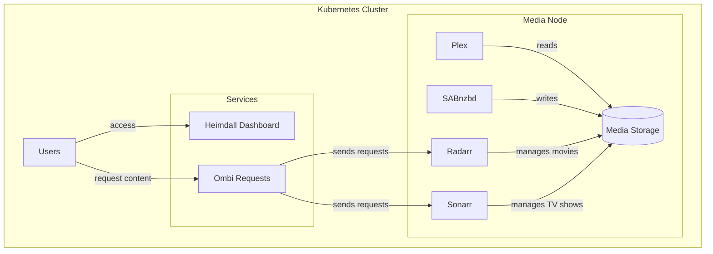
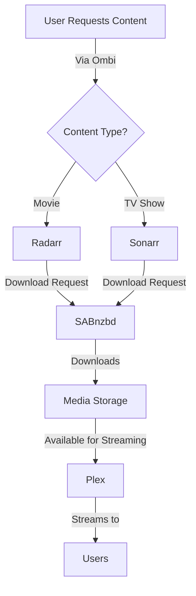

# Kube-Mediabox: Your Personal Media Server on Kubernetes

Welcome to Kube-Mediabox, a comprehensive solution for running your personal media server on Kubernetes. This project is a fork of [shapetheLOLa/kube-mediabox](https://github.com/shapetheLOLa/kube-mediabox), enhanced with updated chart versions, improved configurations, and expanded documentation. The original project provided the foundation for deploying media services on Kubernetes, and this fork builds upon that work with additional features and refinements.

## Project Origins and Enhancements

This fork builds upon the original work by shapetheLOLa, adding several improvements:

1. Updated Helm chart versions and dependencies for all services
2. Enhanced service configurations, particularly for ingress
3. Changed service types to LoadBalancer for improved accessibility
4. Expanded documentation and architecture diagrams
5. Additional deployment options including Longhorn storage support

## How It Works

Kube-Mediabox creates a complete media management system using containerized applications running on Kubernetes. Here's a detailed breakdown of how everything works together:

### Core Components

1. **Media Storage Layer**
    
    - A shared storage volume (PV/PVC) mounted at `/mnt/` holds all your media files
    - Each service has its own configuration volume mounted at `/config/{servicename}`
    - All services run with the same user permissions (UID/GID: 911) to ensure smooth file operations
2. **Download Management**
    
    - SABnzbd handles the actual downloading of content
    - Downloads are saved directly to the shared storage volume
    - The download location is accessible to other services through the shared mount
3. **Media Management**
    
    - Radarr manages your movie library:
        - Monitors for new movies
        - Sends download requests to SABnzbd
        - Handles post-processing (renaming, moving files)
    - Sonarr does the same for TV shows:
        - Tracks TV series
        - Manages episode downloads
        - Organizes the TV library
4. **Media Server**
    
    - Plex reads from the organized media library
    - Handles transcoding when needed
    - Streams content to users' devices
5. **User Interface**
    
    - Heimdall provides a clean dashboard to access all services
    - Ombi allows users to request new content
    - Each service has its own web interface

### Data Flow

1. User requests content through Ombi
2. Request is sent to either Radarr (movies) or Sonarr (TV shows)
3. Radarr/Sonarr searches for the content and sends a download request to SABnzbd
4. SABnzbd downloads the content to the shared storage
5. Radarr/Sonarr processes and organizes the downloaded files
6. Plex detects the new media and makes it available for streaming

## Development Journey

This project evolved through several phases, building upon the original kube-mediabox foundation:

1. **Original Project (by shapetheLOLa)**
    
    - Initial implementation of core media services
    - Basic Helm chart structure and configurations
    - Foundation for service deployments
    - Essential documentation and setup instructions
2. **Fork Enhancement Phase 1 (April 2025)**
    
    - Updated all Helm chart versions to latest stable releases
    - Enhanced .gitignore patterns for Helm charts
    - Added missing Helm chart dependencies
    - Updated TrueCharts common library to version 25.4.10
3. **Fork Enhancement Phase 2 (April 2025)**
    
    - Modified service types from ClusterIP to LoadBalancer
    - Updated ingress configurations for improved access
    - Enhanced networking settings for all services
    - Improved service connectivity and accessibility
4. **Documentation Expansion**
    
    - Added detailed architecture diagrams
    - Created comprehensive flow charts
    - Expanded installation instructions
    - Enhanced troubleshooting guides
    - Added Longhorn storage option documentation
5. **Future Plans**
    
    - Regular chart version updates
    - Additional storage backend options
    - Enhanced security configurations
    - Improved backup solutions
    - Extended monitoring capabilities

## What is Kube-Mediabox?

Kube-Mediabox is a collection of Helm charts that help you deploy and manage media services on your Kubernetes cluster. It uses TrueCharts dependencies for standardized configuration, making the setup process smooth and maintainable.

### Included Services

Each service in the stack has a specific role:

- **Plex**: Your media server that organizes and streams your media collection
- **Sonarr**: Manages your TV shows, automatically finding and downloading new episodes
- **Radarr**: Similar to Sonarr, but for movies
- **SABnzbd**: Downloads content from Usenet servers
- **Heimdall**: A clean dashboard to organize and access all your services
- **Ombi**: Allows users to request new content for your media server

## Architecture



## System Flow



## Prerequisites

Before you begin, make sure you have:

1. A running Kubernetes cluster
2. Helm installed on your system
3. Storage space for your media files
4. A node labeled for mediabox (we'll show you how to do this)

## Storage Configuration

You have two options for storing your configuration files:

1. **Default Method**: Local hostPath on a selected node
    
    - Simpler setup
    - Requires all services to run on the same node
    - Good for home setups
2. **Longhorn Method**: Distributed storage
    
    - More flexible
    - Better for larger setups
    - Requires Longhorn installation

## Installation Guide

### 1. Prepare Your Node

First, label your node to run media services:

```bash
kubectl label node your-node-name app=mediabox
```

### 2. Install Media Storage

Set up the shared storage for your media:

```bash
helm upgrade --install media-pv-pvc ./media-pv-pvc
```

### 3. Install Services

Install each service in the following order. Remember to replace `yourdomain.xyz` with your actual domain:

```bash
# Heimdall Dashboard
cd heimdall
helm dependency build
cd ..
helm upgrade --install heimdall ./heimdall --set ingress.rules.host=heimdall.yourdomain.xyz

# SABnzbd Download Manager
cd sabnzbd
helm dependency build
cd ..
helm upgrade --install sabnzbd ./sabnzbd --set ingress.rules.host=sabnzbd.yourdomain.xyz

# Radarr Movie Manager
cd radarr
helm dependency build
cd ..
helm upgrade --install radarr ./radarr --set ingress.rules.host=radarr.yourdomain.xyz

# Sonarr TV Show Manager
cd sonarr
helm dependency build
cd ..
helm upgrade --install sonarr ./sonarr --set ingress.rules.host=sonarr.yourdomain.xyz

# Plex Media Server
cd plex
helm dependency build
cd ..
helm upgrade --install plex ./plex

# Ombi Request Manager
cd ombi
helm dependency build
cd ..
helm upgrade --install ombi ./ombi --set ingress.rules.host=ombi.yourdomain.xyz
```

## Important Notes

### Permissions

- All services run with UID and GID of 911
- If you encounter permission issues, set the correct permissions before installing:
    
    ```bash
    sudo chown -R 911:911 /path/to/your/config/directories
    ```
    

### Using Longhorn (Alternative Storage)

If you prefer using Longhorn for storage:

1. Install Longhorn:

```bash
helm repo add longhorn https://charts.longhorn.io
helm repo update
helm install longhorn longhorn/longhorn --namespace longhorn-system --create-namespace
```

2. Create disk space on your nodes in the Longhorn UI
3. Create volumes for each service (e.g., radarr-config, sonarr-config)
4. Configure the volumes through the Longhorn UI

## Customization

Each service's configuration can be customized through its respective `values.yaml` file. Common customizations include:

- Changing ports
- Modifying resource limits
- Adjusting storage sizes
- Setting up TLS certificates

## Troubleshooting

Common issues and solutions:

1. **Permission Denied**: Check that the UID/GID settings match (should be 911)
2. **Cannot Find Media**: Verify mount paths in the StatefulSet configurations
3. **Services Not Starting**: Check node labels and ensure services are scheduled on the correct node

## Support and Community

If you need help:

- Check the individual service documentation
- Review the TrueCharts documentation
- File an issue on the project's GitHub repository

## Security Considerations

Remember to:

- Change default passwords
- Use HTTPS for external access
- Regularly update your services
- Back up your configuration