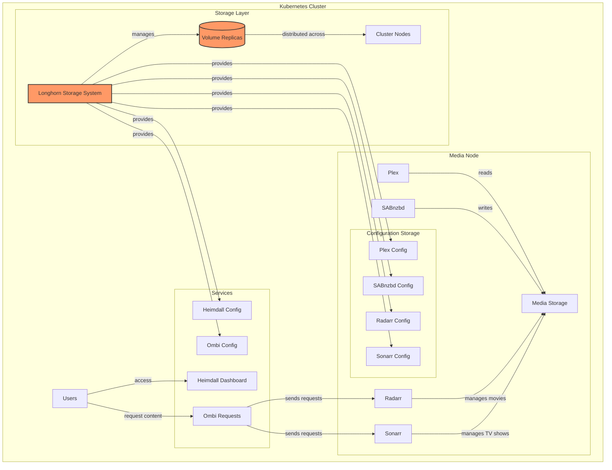
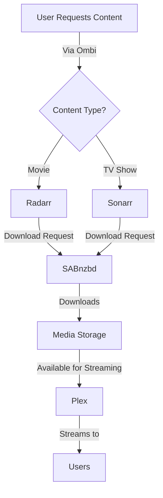

# Kube-Mediabox: Your Personal Media Server on Kubernetes

Welcome to Kube-Mediabox, a comprehensive solution for running your personal media server on Kubernetes using Longhorn distributed storage. This project is a fork of [shapetheLOLa/kube-mediabox](https://github.com/shapetheLOLa/kube-mediabox), enhanced with updated chart versions, improved configurations, and a robust distributed storage architecture. While the original project provided the foundation for deploying media services on Kubernetes, this fork standardizes on Longhorn for reliable storage management and adds several key improvements.

## Project Architecture

Kube-Mediabox combines popular media services with Longhorn's distributed storage system to create a reliable and scalable media server. The architecture ensures your media files and service configurations are safely replicated across your cluster, providing both redundancy and ease of management.

This fork builds upon the original work by shapetheLOLa, adding several improvements:

1. Updated Helm chart versions and dependencies for all services
2. Enhanced service configurations, particularly for ingress
3. Changed service types to LoadBalancer for improved accessibility
4. Standardized on Longhorn for reliable distributed storage
5. Expanded documentation and architecture diagrams

## How It Works

Kube-Mediabox creates a complete media management system using containerized applications running on Kubernetes. Here's a detailed breakdown of how everything works together:

### Core Components

1. **Media Storage Layer**
   - A shared storage volume (PV/PVC) mounted at `/mnt/` holds all your media files
   - Each service has its own configuration volume mounted at `/config/{servicename}`
   - All services run with the same user permissions (UID/GID: 911) to ensure smooth file operations

2. **Download Management**
   - SABnzbd handles the actual downloading of content
   - Downloads are saved directly to the shared storage volume
   - The download location is accessible to other services through the shared mount

3. **Media Management**
   - Radarr manages your movie library:
     - Monitors for new movies
     - Sends download requests to SABnzbd
     - Handles post-processing (renaming, moving files)
   
   - Sonarr does the same for TV shows:
     - Tracks TV series
     - Manages episode downloads
     - Organizes the TV library

4. **Media Server**
   - Plex reads from the organized media library
   - Handles transcoding when needed
   - Streams content to users' devices

5. **User Interface**
   - Heimdall provides a clean dashboard to access all services
   - Ombi allows users to request new content
   - Each service has its own web interface

### Data Flow

1. User requests content through Ombi
2. Request is sent to either Radarr (movies) or Sonarr (TV shows)
3. Radarr/Sonarr searches for the content and sends a download request to SABnzbd
4. SABnzbd downloads the content to the shared storage
5. Radarr/Sonarr processes and organizes the downloaded files
6. Plex detects the new media and makes it available for streaming

## Development Journey

This project evolved through several phases, building upon the original kube-mediabox foundation:

1. **Original Project (by shapetheLOLa)**
   - Initial implementation of core media services
   - Basic Helm chart structure and configurations
   - Foundation for service deployments
   - Essential documentation and setup instructions

2. **Storage Architecture Redesign (April 2025)**
   - Implemented Longhorn as the standard storage solution
   - Removed local storage dependencies
   - Created distributed storage architecture
   - Enhanced volume management and replication

3. **Service Enhancements (April 2025)**
   - Updated all Helm chart versions to latest stable releases
   - Modified service types to LoadBalancer
   - Updated ingress configurations
   - Improved service connectivity

4. **Documentation Expansion**
   - Added detailed architecture diagrams
   - Created comprehensive flow charts
   - Expanded installation instructions
   - Enhanced troubleshooting guides
   - Added detailed Longhorn configuration guides

5. **Future Plans**
   - Regular chart version updates
   - Enhanced backup solutions
   - Improved monitoring capabilities
   - Advanced Longhorn integration features

## What is Kube-Mediabox?

Kube-Mediabox is a collection of Helm charts that help you deploy and manage media services on your Kubernetes cluster. It uses TrueCharts dependencies for standardized configuration, making the setup process smooth and maintainable.

### Included Services

Each service in the stack has a specific role:

- **Plex**: Your media server that organizes and streams your media collection
- **Sonarr**: Manages your TV shows, automatically finding and downloading new episodes
- **Radarr**: Similar to Sonarr, but for movies
- **SABnzbd**: Downloads content from Usenet servers
- **Heimdall**: A clean dashboard to organize and access all your services
- **Ombi**: Allows users to request new content for your media server

## Architecture

The system can be configured to use either local storage or Longhorn distributed storage. Here's how it all fits together:



### Understanding Longhorn Storage

Longhorn provides a robust distributed storage solution that enhances the reliability and flexibility of your media server setup. Here's what it brings to the system:

1. **Distributed Storage Management**
   - Automatically replicates data across multiple nodes
   - Ensures high availability of your configuration files
   - Allows services to run on any node in the cluster
   - Manages storage volumes dynamically

2. **Configuration Persistence**
   - Each service gets its own persistent volume
   - Configurations survive pod restarts and node failures
   - Easy backup and restore capabilities
   - Consistent storage across cluster updates

3. **Benefits Over Local Storage**
   - No need for manual node selection
   - Better fault tolerance through replication
   - Easier scaling and maintenance
   - Built-in backup and disaster recovery

4. **Volume Management**
   - Creates independent volumes for each service
   - Handles volume attachment and detachment
   - Provides snapshot capabilities
   - Offers monitoring and health checks

When using Longhorn, your service configurations become more resilient and portable. Instead of being tied to a specific node's local storage, they can move freely within the cluster while maintaining their state and settings. This is particularly valuable for larger setups or environments where high availability is important.

## System Flow



## Prerequisites

Before you begin, make sure you have:

1. A running Kubernetes cluster
2. Helm installed on your system
3. Storage space for your media files
4. A node labeled for mediabox (we'll show you how to do this)

# Storage Configuration

This project uses Longhorn for distributed storage management. Longhorn provides a robust and reliable way to handle persistent storage in your Kubernetes cluster, ensuring your media server's data and configurations are safely managed and replicated.

Understanding how Longhorn works in our setup will help you get the most out of your media server. When you deploy a service like Radarr or Sonarr, Longhorn automatically creates and manages a persistent volume for that service's configuration. These volumes are replicated across your cluster nodes, providing redundancy and protection against node failures.

Let's walk through setting up Longhorn for your media server:

1. First, install Longhorn in your cluster:
```bash
helm repo add longhorn https://charts.longhorn.io
helm repo update
helm install longhorn longhorn/longhorn --namespace longhorn-system --create-namespace
```

2. Once Longhorn is installed, access the Longhorn UI through its service. You'll use this interface to:
   - Monitor your storage resources
   - Create and manage volumes
   - Configure backup settings
   - Check volume health and replication status

3. Create the following volumes through the Longhorn UI:
   - plex-config
   - radarr-config
   - sonarr-config
   - sabnzbd-config
   - heimdall-config
   - ombi-config

Each volume will store its respective service's configuration data. The services are already configured to look for these volume names, so once they're created, everything will connect automatically.

For your media storage, create a separate volume called 'media-storage'. This volume will hold all your media files and should be sized according to your needs. The media-storage volume will be mounted to your services at `/mnt/`, allowing them to share access to your media library.

Remember to configure your volume replicas based on your cluster size. For most home setups, 2 replicas provide a good balance of redundancy and resource usage.

## Installation Guide

### 1. Prepare Your Node

First, label your node to run media services:

```bash
kubectl label node your-node-name app=mediabox
```

### 2. Install Media Storage

Set up the shared storage for your media:

```bash
helm upgrade --install media-pv-pvc ./media-pv-pvc
```

### 3. Install Services

Install each service in the following order. Remember to replace `yourdomain.xyz` with your actual domain:

```bash
# Heimdall Dashboard
cd heimdall
helm dependency build
cd ..
helm upgrade --install heimdall ./heimdall --set ingress.rules.host=heimdall.yourdomain.xyz

# SABnzbd Download Manager
cd sabnzbd
helm dependency build
cd ..
helm upgrade --install sabnzbd ./sabnzbd --set ingress.rules.host=sabnzbd.yourdomain.xyz

# Radarr Movie Manager
cd radarr
helm dependency build
cd ..
helm upgrade --install radarr ./radarr --set ingress.rules.host=radarr.yourdomain.xyz

# Sonarr TV Show Manager
cd sonarr
helm dependency build
cd ..
helm upgrade --install sonarr ./sonarr --set ingress.rules.host=sonarr.yourdomain.xyz

# Plex Media Server
cd plex
helm dependency build
cd ..
helm upgrade --install plex ./plex

# Ombi Request Manager
cd ombi
helm dependency build
cd ..
helm upgrade --install ombi ./ombi --set ingress.rules.host=ombi.yourdomain.xyz
```

## Important Notes

### Permissions

- All services run with UID and GID of 911
- If you encounter permission issues, set the correct permissions before installing:
  ```bash
  sudo chown -R 911:911 /path/to/your/config/directories
  ```


## Customization

Each service's configuration can be customized through its respective `values.yaml` file. Common customizations include:

- Changing ports
- Modifying resource limits
- Adjusting storage sizes
- Setting up TLS certificates

## Troubleshooting

When running into issues, here are some common solutions:

### Volume Issues

If you experience problems with Longhorn volumes:

1. Check the volume state in the Longhorn UI:
   - Ensure all replicas are healthy
   - Verify the volume is attached to the correct node
   - Check available storage space on your nodes

2. If a volume is degraded:
   - Wait for rebuilding to complete
   - Check node connectivity
   - Verify disk space on replica nodes

3. For slow performance:
   - Check network connectivity between nodes
   - Verify your storage network configuration
   - Consider adjusting the number of replicas

### Service Configuration

When services aren't working as expected:

1. Verify volume mounts:
```bash
kubectl describe pod [pod-name]
```
Look for successful volume mounts in the events section.

2. Check service logs:
```bash
kubectl logs [pod-name]
```
Watch for permission issues or connection errors.

3. Verify service connectivity:
```bash
kubectl get svc
```
Ensure services are properly exposed.

### Performance Optimization

To improve system performance:

1. Configure Longhorn settings:
   - Adjust replica count based on your cluster size
   - Set appropriate storage overprovisioning
   - Configure backup schedules during off-peak hours

2. Resource allocation:
   - Monitor CPU and memory usage
   - Adjust resource limits in service configurations
   - Consider node capacity when placing replicas

## Support and Community

For assistance with:

1. Longhorn issues:
   - Visit the [Longhorn documentation](https://longhorn.io/docs/)
   - Check the [Longhorn GitHub issues](https://github.com/longhorn/longhorn/issues)
   - Join the Longhorn Slack channel

2. Media services:
   - Reference individual service documentation
   - Check service-specific forums
   - Review TrueCharts documentation

3. This project:
   - Create an issue in the GitHub repository
   - Check existing issues for solutions
   - Contribute improvements via pull requests

## Security Considerations

Remember to:
- Change default passwords
- Use HTTPS for external access
- Regularly update your services
- Back up your configuration